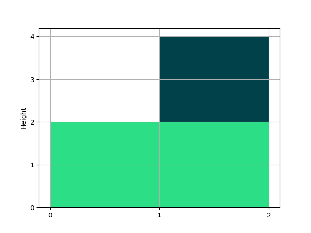
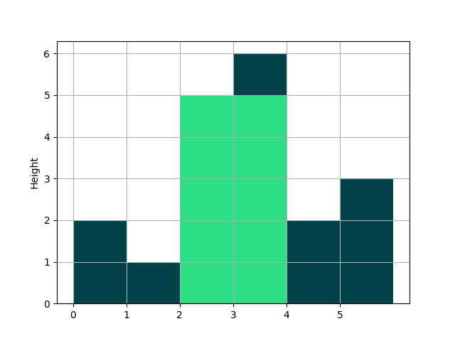

# Task 3 - Largest rectangle in histogram

## Description

Consider an array of integer numbers, that will represent the height
of histogram bars, and each bar, will have a width of 1.
Write a program that return the larges rectangle possible in the whole
histogram.

## Input and output

Consider the following case, where the input is `[2, 4]`,
the output should be `4`, and it can be seen in the following figure:

The green area is the largest rectangle possible.
Also notice that the rectangle with only second bar would have also be a valid solution because its area is `4` as well.

On a more complex case, consider the heights `[2, 1, 5, 6, 2, 3]`
the output in this scenario is `10`:

In the previous case, you can see that the combination of the bars
with height `5` and `6` form the largest rectangle with an area of
10, highlighted by the green color.

## Example test cases

* Input: `[1, 2, 2, 2]`
* Output: 6

* Input: `[2, 10, 2]`
* Output: 10

* Input: `[4]`
* Output: 4
